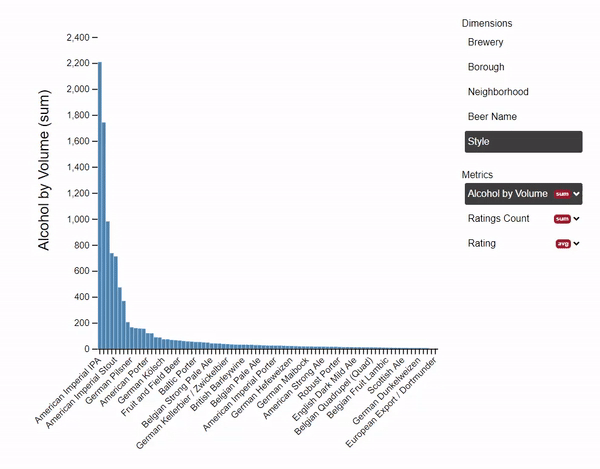
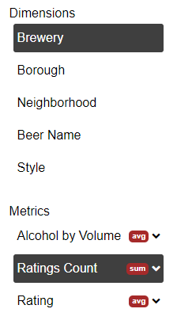
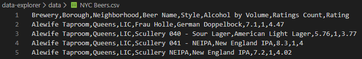

# Data Explorer

[Link to live site](https://saaaaaage.github.io/data-explorer/)

Did you know that the beer brewed in Brooklyn has the highest average rating among the 5 boroughs? I didn't! Every dataset has a story to tell. If you twist it, turn it, and let the light hit it just right, it'll share that story with you. Data Explorer is a celebration of the search for that story; of diving headfirst into a dataset, armed only with a trusty analytical tool. So jump in! Play with this data and see if you can't find an interesting fact to fire off around the water cooler.



## Technologies

Data Explorer is built with JavaScript, HTML and SCSS.  The bar chart and relevant labels are built using the D3.js library.  The dynamic updates to the page are built out of pure JS event listeners and DOM manipulation without jQuery.

## Features

### Dataset Selection

The Data Explorer project comes packaged with a few datasets to illustrate the tool's independence from the data it is displaying.  Any CSV file with headers can be plugged into the project and visualized.  When a new dataset is selected, the `loadDataSet.js` script will call the functions necessary to update each relevant component on the page.

```
d3.csv(file, d => d3.autoType(d)).then(rawData => {
    window.DataExplorer = {};
    DataExplorer.rawData = rawData;

    // Construct Dimension and Metric lists
    buildLists(rawData);

    // Get currently selected options from Dim/Met lists
    let options = getOptions();

    // Aggregate data per options object, and build the D3.js chart
    updateChart(options);
});
```

### Building the Field Lists

The field list allows the user to select the dimension to display, the metric to measure, and how that metric should be aggregated.



The first row of the CSV file determines the fields to display, which are separated into dimensions (ways to slice up data) and metrics (values that can be aggregated).



Whether a field is a dimension or a metric is determined by sampling data in each column and testing whether or not it is a numerical value.  This works as long as the data is generally clean and trustworthy.  More suspect data would require more thorough testing.
```
rawData.columns.forEach(col => {
    if (!!parseInt(rawData[0][col])) {
        metrics.push(col);
    } else {
        dimensions.push(col);
    }
});
```

From there, the lists are added to the page using pure JS.  Here is the snippet that constructs the simpler list of dimensions:

```
const dimUl = document.getElementById("dim-ul");
dimUl.innerHTML = "";

dimensions.forEach(dim => {
    const dimLi = document.createElement("li");
    dimLi.classList.add("field");
    dimLi.innerHTML = dim;
    dimLi.addEventListener("click", e => {
        if (!e.target.classList.contains('active')) {
            Array.from(dimUl.getElementsByClassName('active')).forEach(li => {
                li.classList.remove('active');
            });
            e.target.classList.add('active');
            updateChart(getOptions());
        }
    });
    dimLi.dataset.fn = 'sum';
    dimLi.dataset.field = dim;
    dimUl.appendChild(dimLi);
});
dimUl.firstElementChild.classList.add('active');
```


### Aggregating the Data

Any update to the dataset, selected dimension, selected metric, or aggregation function will not directly redraw the chart, but will instead call the `update_chart.js` script.

```
export default options => {
    // Aggregate data per the current selections
    let aggData = aggregateData(options);
    
    // Update the options object
    options.data = aggData;
    
    // Draw the D3.js chart per the options object
    drawChart(options);
};
```

This function sits between the user's actions and the draw logic to make sure the raw data from the dataset is aggregated before drawing takes place.  The aggregation takes place in `aggregate_data.js` to return an aggregated set according to the selected aggregation function.

Data will enter the aggregation function in its raw form:
```
[{
    Brewery: "Alewife Taproom",
    Borough: "Queens",
    Neighborhood: "LIC",
    Beer Name: "Frau Holle",
    Style: "German Doppelbock",
    Alcohol by Volume: 7.1,
    Ratings Count: 1,
    Rating: 4.47
}],
[{...}],
[{...}],
[{...}],
...
```

The data will then be organized according to the selected dimension per this snippet.

```
data.forEach(row => {
    let dimValue = row[dimension];
    let collectedValues = staging[dimValue] || [];
    collectedValues.push(row[metric]);
    staging[dimValue] = collectedValues;
});
```

EG if we have chosen to aggregate by `Borough`, we'd end up with this staging object:

```
{
    Queens: [7.1, 5.76, 8.3, ...]
    Brooklyn: [5.6, 8.6, 4.6, ...]
    Bronx: [6.5, 7.5, 4.8, ...]
}
```

Then the array of values is simply reduced down to a single value according to the selected aggregation function:
```
let aggData = [];
Object.keys(staging).forEach((key, i) => {
    switch (fn) {
        case "sum":
            aggData.push({
                [dimension]: key,
                [metric]: staging[key].reduce((a, b) => a + b, 0)
            });
            break;
        case "average":
            aggData.push({
                [dimension]: key,
                [metric]: (staging[key].reduce((a, b) => a + b, 0))/staging[key].length
            });
            break;
        case "min":
            aggData.push({
                [dimension]: key,
                [metric]: Math.min(...staging[key])
            });
            break;
        case "max":
            aggData.push({
                [dimension]: key,
                [metric]: Math.max(...staging[key])
            });
            break;
        default:
            break;
    }
});
```

Finally, we are left with a simple list of distinct dimensional values, and their associated metrics:
```
[
    {Borough: "Queens", Alcohol by Volume: 6.78},
    {Borough: "Brooklyn", Alcohol by Volume: 6.64},
    {Borough: "Bronx", Alcohol by Volume: 6.37}
]
```

### Drawing the Chart

The chart is drawn in the `drawChart.js` file using the D3.js library.  At a high level, this function creates an SVG object, then draws the bars, x axis, y axis, and y axis label.

Here is a sample of the code that draws the bars:

```
svg.append("g")
        .attr("fill", "steelblue")
    .selectAll("rect")
    .data(data)
    .join("rect")
        .attr("x", (d, i) => x(i))
        .attr("y", d => y(0))
        .attr("height", d => y(0) - y(0))
        .attr("width", x.bandwidth())
```